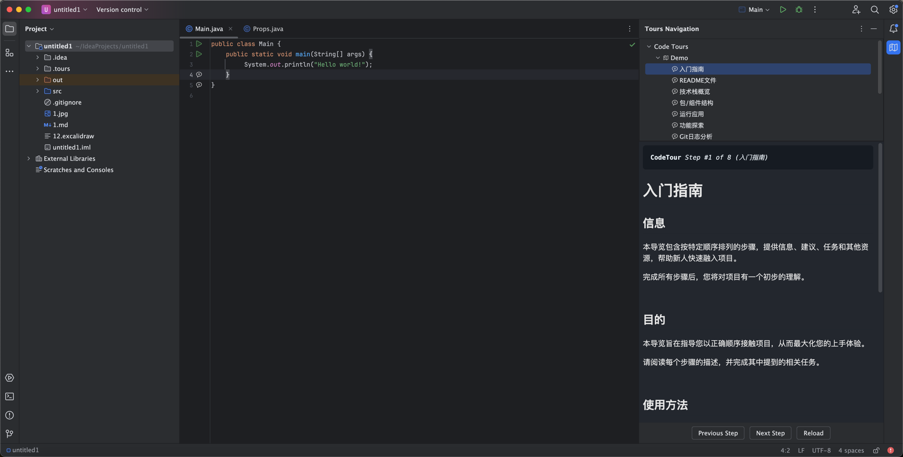
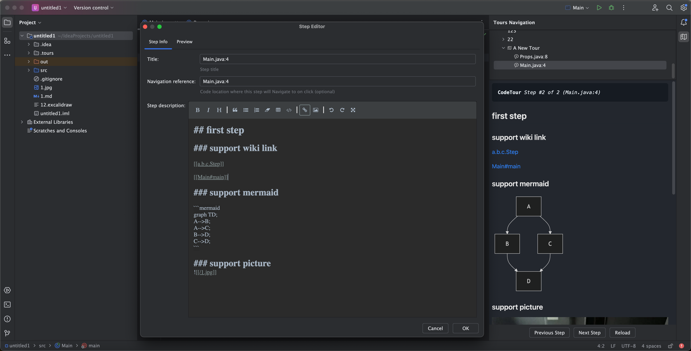
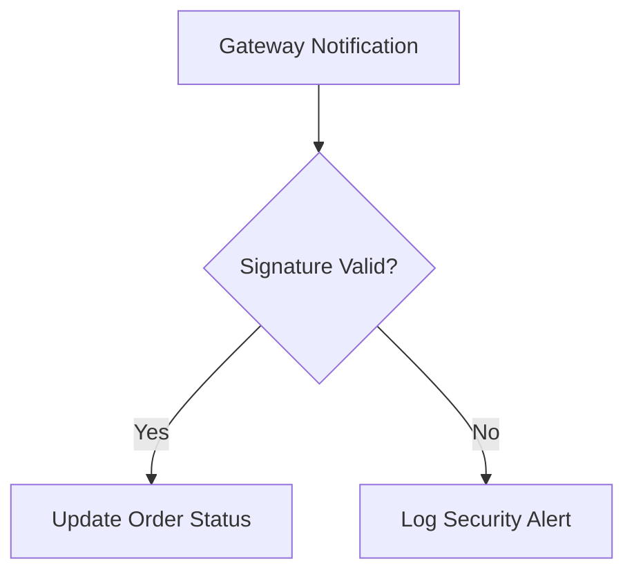

# MyCodeTour: Interactive Code Walkthroughs for IntelliJ

🚀 **The Smart Code Navigation Plugin for IntelliJ Platform**  
A fork of CodeTour supercharged with intuitive workflows. Transform codebases into explorable knowledge maps – accelerate onboarding and streamline knowledge sharing.

---

## 🌟 Core Features

### One-Click Tour Creation
▸ **Gutter Markers**: Right-click editor gutter > **Add Tour Step** (as simple as setting breakpoints)  
▸ **Rich Content Support**: Markdown/HTML formatting with embedded diagrams and code snippets  
▸ **Customizable Popups**: Adjustable note windows (position/size/fonts) for optimal readability

### Visual Navigation System
▸ **Tour Dashboard**: Access via <kbd>View</kbd> > <kbd>Tool Windows</kbd> > <kbd>Tours Navigation</kbd>  
▸ **Precision Jump**: Auto-navigate to code lines with single click on tour steps

### Team Knowledge Hub
▸ **Version-Control Ready**: Store tours alongside code for collaborative maintenance

<!-- Plugin description -->
**Interactive Code Walkthroughs for IntelliJ**

Create guided code tours directly in your IDE. Anchor step-by-step explanations to specific code lines with Markdown/HTML annotations.

**Key Features:**
- Add steps via editor gutter (right-click > *Add Tour Step*)
- Version-controlled `.tour` files for team collaboration
- Jump between steps via the **Tours Navigation** tool window

**Use Cases:**
- Onboarding guides
- Code reviews
- Bug documentation
- Architecture walkthroughs

*Transform code into a narrated journey, keeping knowledge anchored to the codebase.*
<!-- Plugin description end -->

---

## 🛠️ Use Cases

### 👨💻 **Enhanced Code Reviews**
Annotate PR changes with contextual explanations  
*Example: Add step-by-step rationale for complex refactors*

### 📚 **Living Documentation**
Anchor system diagrams and API docs directly to code  
*Example: Embed flowchart in core algorithm module*

### 🐞 **Visual Bug Tracking**
Create reproducible bug investigation paths  
*Example: Document race condition reproduction steps*

### 🎯 **Accelerated Onboarding**
Build self-guided learning paths for new hires  
*Example: Tour covering setup, architecture, and key workflows*

---

## 🛠️ Installation

### Marketplace Install (Recommended)
<kbd>File</kbd> > <kbd>Settings</kbd> > <kbd>Plugins</kbd> > <kbd>Marketplace</kbd>  
Search "MyCodeTour" > Click <kbd>Install</kbd>

### Manual Install
1. Download [latest release](https://github.com/jinsihou19/MyCodeTour/releases/latest)
2. <kbd>File</kbd> > <kbd>Settings</kbd> > <kbd>Plugins</kbd> > <kbd>⚙️</kbd> > <kbd>Install Plugin from Disk...</kbd>

### UI

#### Main UI


#### Editor


---

## 📌 Best Practices

### Tour Structure Example
```markdown
# Order Module Walkthrough
## Core Flow
1. Order Entry → [[OrderController.create()]]
2. Pricing Strategy → [[PriceCalculator.applyDiscounts()]]
3. Payment State Machine → [[PaymentStateMachine.handle()]]

## Resources
- [Architecture Decision Record]()
- [Domain Model Diagram]()
```

### Annotated Code Example
````markdown
**Payment Callback Handling**  

> 🔐 Transaction boundary management in [[PaymentService#processCallback]]
````

---

[📘 Full Documentation](https://github.com/jinsihou19/MyCodeTour) | [🐞 Report Issues](https://github.com/jinsihou19/MyCodeTour/issues)  
Make code explanations timeless – build a living knowledge base that evolves with your project!