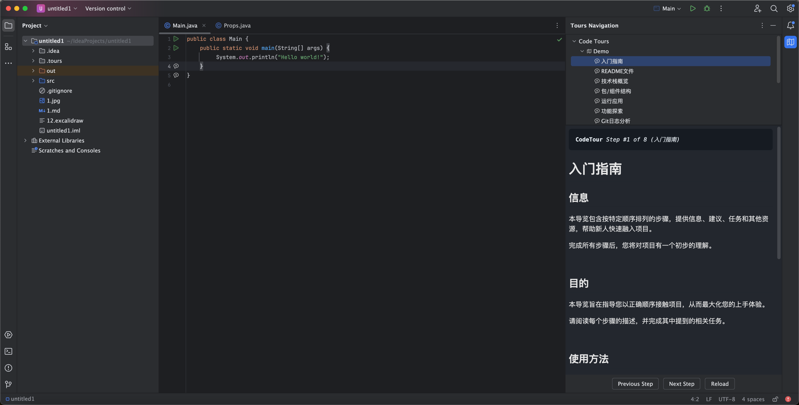

# MyCodeTour：代码导览专家

🚀 **IntelliJ 平台智能代码导航插件**  
助您构建可交互的代码学习路径。让代码库变成可探索的知识地图，新人快速上手，老手高效传承。

---

## 🌟 核心功能

### 一键式导览创建
▸ **装订区标记**：右键点击编辑器装订区 > **添加导览步骤**，操作如同设置断点般简单  
▸ **多格式支持**：步骤描述支持 Markdown/HTML 格式，图文混排更直观  
▸ **智能弹窗**：可自定义的悬浮说明框（位置/尺寸/字体），阅读体验自由掌控

### 可视化导航系统
▸ **导览仪表盘**：通过 <kbd>视图</kbd> > <kbd>工具窗口</kbd> > <kbd>导览导航</kbd> 开启树形导航面板  
▸ **精准跳转**：点击导览步骤即可自动定位对应代码行，告别手动搜索
▸ **智能搜索**：
  - 支持全文本搜索所有导览步骤
  - 可按文件、标签或内容类型筛选
  - 支持模糊匹配，快速定位目标内容

▸ **丰富图表支持**：
  - **Mermaid**：创建流程图、时序图等各类图表
  - **PlantUML**：设计 UML 图和系统架构图
  - **Excalidraw**：绘制手绘风格的示意图和草图

### 团队知识沉淀
▸ **版本控制友好**：导览配置与代码库同步提交，实现知识资产化

---

## 🛠️ 适用场景

### 👨💻 **代码审查增强**
逐层解析 Pull Request 修改逻辑，让代码变更脉络一目了然  
*示例：在关键修改处添加步骤说明，引导审查者理解重构意图*

### 📚 **活文档系统**
将功能实现逻辑直接锚定到代码位置，打造可执行的开发文档  
*示例：在核心算法模块添加流程图说明，新人自学效率提升 60%*

### 🐞 **缺陷可视化**
标记问题代码的触发路径，构建可复现的缺陷追踪导览  
*示例：重现偶现异常时，通过步骤记录复现路径关键节点*

### 🎯 **新人极速入职**
为项目/模块创建交互式学习路径，降低 80% 的人工指导成本  
*示例：新成员克隆仓库后，跟随导览即可自主完成环境搭建与核心逻辑学习*

---

## 🛠️ 安装指南

### 自动安装（推荐）
<kbd>文件</kbd> > <kbd>设置</kbd> > <kbd>插件</kbd> > <kbd>市场</kbd>  
搜索 "MyCodeTour" > 点击 <kbd>安装</kbd>

### 手动安装
1. 下载 [最新版本](https://github.com/jinsihou19/MyCodeTour/releases/latest)
2. <kbd>文件</kbd> > <kbd>设置</kbd> > <kbd>插件</kbd> > <kbd>⚙️</kbd> > <kbd>从磁盘安装...</kbd>

### 界面

#### 主界面


#### 编辑界面


---

## 📌 最佳实践

### 导览结构设计
```markdown
# 订单模块导览
## 核心流程
1. 订单创建入口 → [[OrderController.create()]]
2. 价格计算策略 → [[PriceCalculator.applyDiscounts()]]
3. 支付状态机 → [[PaymentStateMachine.handle()]]

## 扩展阅读
- [架构设计文档]()
- [领域模型图示]()
```

### 步骤注释规范
````markdown
**支付回调处理**  

> 📌 注意事务边界处理，参考 [[PaymentService#processCallback]]
````

## 系统架构概览


## 系统组件关系


## 白板记录
```excalidraw
![[whiteboard.excalidraw]]
```


---

[📘 查看完整开发文档](https://github.com/jinsihou19/MyCodeTour) | [🐞 提交问题反馈](https://github.com/jinsihou19/MyCodeTour/issues)  
让代码讲解突破时空限制，构建可传承的技术知识库！